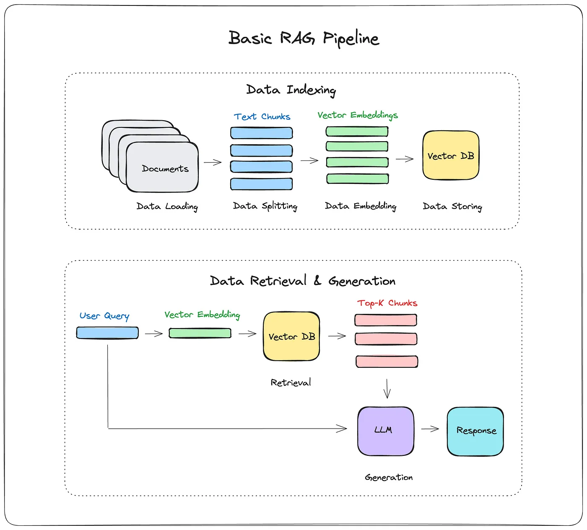
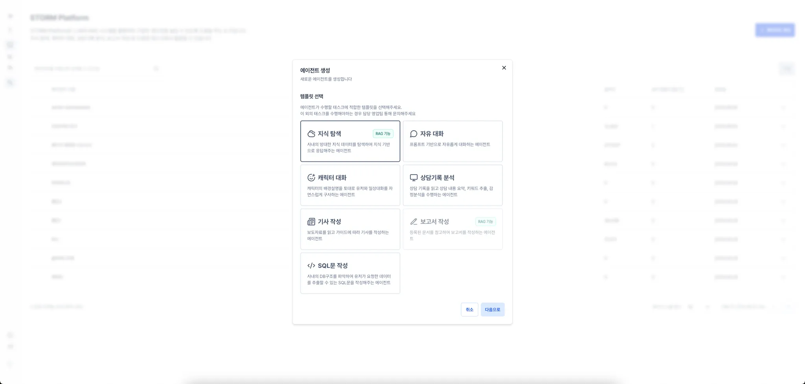
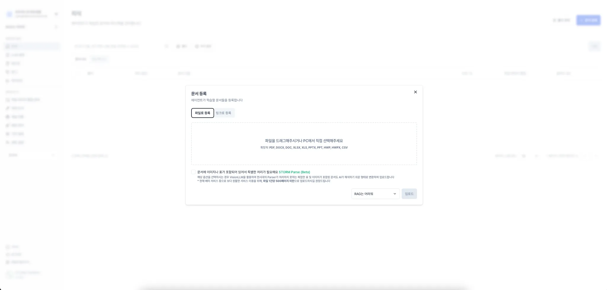
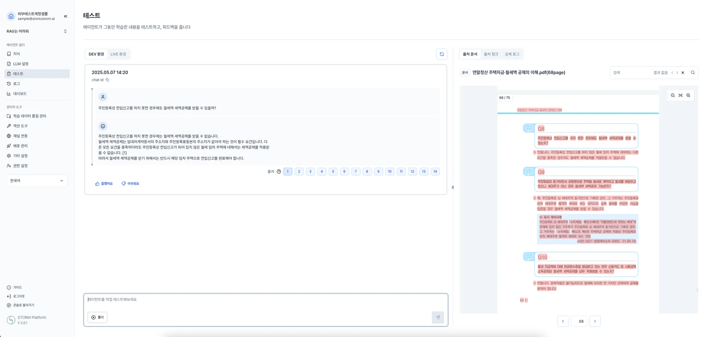
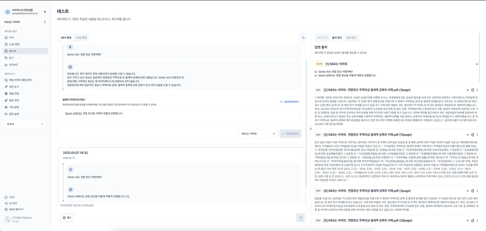
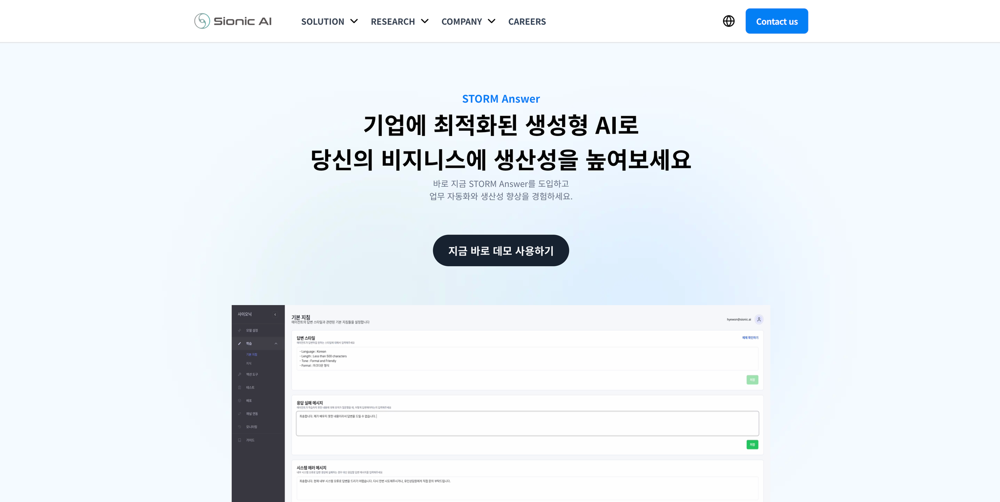

이전 세션들을 통해 AI의 기초 개념은 익혔지만, 실제 서비스를 개발하고 적용하는 일은 여전히 어렵습니다. 특히 다음과 같은 AI 기술들은 진입장벽이 꽤 높습니다.

- 임베딩(embedding) 모델은 어떻게 선택해야할까?
- 벡터 데이터베이스(vector DB)는 어떤 걸 써야 하고, 어떻게 설계해야할까?

직접 RAG 시스템을 구축하려면, 문서를 청킹하고, 임베딩 모델로 벡터를 생성한 후, 벡터 DB에 저장하고, 질의 시 검색 및 리랭킹 과정을 거쳐야 합니다.

## RAG 파이프라인을 직접 구축하려면..

### 1단계: **데이터 색인 (Data Indexing)**

> 문서를 저장하는 단계입니다.

1. **문서 청킹(Chunking)**

- 긴 문서를 한 덩어리로 처리하면 성능이 안 나옵니다.
- 그래서 **적절한 길이로 나눠야** 하고, 이때 어떤 기준으로 나눌지 고민이 필요합니다.
  - 그냥 토큰 수 기준?
  - 문장/문단 기준?
- 이걸 **청킹 전략**이라고 부르며, 실제 검색 정확도에 영향을 줍니다.

<aside>
✅

Sionic AI는 문서 구조를 파악한 뒤, 내부 청킹 로직을 통해 문맥 단위로 자연스럽게 나눕니다.

</aside>

2. **청크된 데이터 임베딩**

- 문장을 벡터로 바꾸는 작업입니다.
- 여기에 어떤 **임베딩 모델**을 쓸지가 중요합니다.
  - 다국어 지원, 길이 제한, 응답 속도등을 고려해야합니다.

<aside>
✅

Sionic AI는 문서 언어와 성격을 보고 자동으로 최적의 모델을 선택해줍니다.

</aside>

3. **벡터 DB에 저장**

- 임베딩한 벡터를 빠르게 검색하려면 **벡터 전용 데이터베이스**가 필요합니다.
- 여기서 고민할 포인트
  - 어떤 벡터 DB를 쓸까? (예: Qdrant, Pinecone)
  - 얼마나 많은 데이터를 넣을 수 있나?
  - 검색 속도는 얼마나 빠른가?
  - 백업과 스케일링은 어떻게 할까?
  - DB 설계는 어떻게 할까?

<aside>
✅

Sionic AI는 내부적으로 최적화된 벡터 DB를 자동 생성하고 운영까지 맡습니다.

</aside>

## 2단계: **질의응답 (Data Retrieval & Generation)**

> 사용자가 질문했을 때, 관련 정보를 찾아 답변하는 단계입니다.

1. **질문 임베딩**

- 사용자가 질문을 입력하면, 이 질문도 똑같이 **벡터로 임베딩**해야 합니다.
- 하지만 질문이 **짧거나 모호**하면, **엉뚱한 결과**가 나올 수 있습니다.
  > 예: `"보장 내용은?"` 같은 짧은 질문은 문맥이 없으면 AI가 어떤 보장을 말하는지 알기 어렵습니다. 그래서 질문을 `"계약서 상의 보험 보장 내용은 무엇인가?"` 처럼 **명확하게 확장**해줄 수 있습니다.
- 그래서 쿼리 확장(Query Expansion)과 같은 기술이 필요할 수 있습니다.

<aside>
✅

**Sionic AI는 자동으로 쿼리를 확장**해, 모호한 질문도 정확히 검색되도록 보정합니다.

</aside>

2. **Top-K Retrieval (최상위 K개 검색)**

- DB에서 질문과 유사한 청크들을 Top-K 방식으로 검색합니다.
- 여기서 중요한 건 **Retrieval 방식의 전략**입니다.
  - 단순 유사도 (Semantic Search)만 쓸지?
  - Hybrid Search (Lexical + Semantic) 같이 쓸지?
  - 리랭커(rerank) 모델을 추가할지?

<aside>
✅

Sionic AI는 자체 **retriever와 reranker**를 통해 관련 문서를 정확히 찾고, 가장 적절한 내용을 선별해 **정확한 답변을 제공합니다.**

</aside>

그러나 위와같은 AI의 세부적인 기술들을 모두 알지 못하더라도, **SionicAI 플랫폼**을 사용하면 아주 쉽게 **문서학습 부터 질의응답까지 가능합니다.**

## Sionic AI는 이런 문제를 어떻게 해결할까?

https://www.sionic.ai/ko

**Sionic AI**는 이런 복잡한 AI 기술들을 추상화하여 **"개발자가 손쉽게 AI 기능을 활용할 수 있는 플랫폼"**을 제공합니다.

> "고객은 복잡한 AI 기술을 신경 쓰지 않고, 자신의 비즈니스에만 집중하면 됩니다.
> 나머지 복잡한 모든 과정은 SionicAI가 해결해 드립니다."

즉, **Sionic AI는 고객과 AI를 이어주는 다리** 역할을 합니다.

| 어려운 기술 과제              | Sionic AI에서의 해결 방식                           |
| ----------------------------- | --------------------------------------------------- |
| 직접 임베딩 모델 구축 및 운영 | ✔️ 자동으로 사용자 데이터에 최적화된 임베딩 처리    |
| 벡터 DB 구축, 운영, 스케일링  | ✔️ 자동으로 벡터 DB 생성 및 관리 (백업/최적화 포함) |
| 리랭커 도입 및 파라미터 튜닝  | ✔️ 리랭커 모델 자동 적용, 답변 정밀도 향상          |
| 모델 업데이트 및 지속적 학습  | ✔️ 사용자 피드백 기반 자동 학습 개선                |

## **AI Agent란?**

AI Agent는 **특정 도메인 지식에 특화되어 사용자의 질문이나 요청을 스스로 이해하고, 관련 정보를 찾아** **가장 정확한 답변을 제공하는 AI**입니다. 이는 굉장히 복잡하고 어려운 일이고, 단순한 로직 구현으로 해결되는 문제가 아닙니다.

**하지만 SionicAI에서는 이 모든 과정을 클릭 몇 번으로 해결할 수 있도록 합니다.** AI Agent는 STORM Platform이 제공하는 핵심 기능 중 하나로, 고객의 데이터를 기반으로 상황을 실시간으로 분석하고, 그에 맞는 맞춤형 대응을 제시합니다. 또한, 지속적인 학습을 통해 점점 더 정교해지는 학습형 AI의 역할을 수행합니다.

## **Sionic AI Storm 활용하기**

다음은 Sionic AI에서 AI Agent를 만드는 구체적인 절차입니다.

1. **에이전트 생성**

   

   - SionicAI 플랫폼에서 "에이전트 생성" 클릭
   - RAG ON/OFF 선택

2. **문서 업로드**

   

   - 내가 원하는 PDF, Word 등 자료를 업로드
   - 이미지나 표를 적절히 파싱하는 **Storm Parse** 사용 가능
     - Storm Parse는 단순 텍스트 추출이 아니라, **문서의 구조를 인식한 청킹**을 수행합니다.
     - 예를 들어, 표 제목과 데이터, 이미지 캡션 등을 함께 추출하여 질의응답 정확도를 높여줍니다.

3. **즉시 질의응답**

   

   - 내가 학습시킨 문서에 대해 즉시 질의응답 수행 가능
   - 별도의 복잡한 설정 없이 즉시 사용 가능
   - 참조한 문서 청크 확인 가능

4. 피드백 기반 학습

   

## Storm 직접 사용해보기

⭐️ [지금 바로 Storm Platform 사용해보기](https://www.sionic.ai/ko/answer)

### 🔥 10 Minute Mission

> 각자 저에게 이메일 전달주시면 가입 초대링크 전달드리겠습니다!

1. 초대 링크로 가입하기
2. 에이전트 생성하기
3. 문서 등록하기
4. 테스트 질의하기

위 4 단계 진행해주시면 됩니다~! (정말 쉬워요 빠르면 3분컷 가능!!)

## Storm Open API 활용해서 RAG 어플리케이션 만들기

https://app.apidog.com/project/689527

Storm 페이지에서 올린 문서를 바로 AI가 학습하므로, 어플리케이션 사용자가 그에 대한 질문을 던져 응답을 받도록 자동화할 수 있습니다.

- **문서 학습 요청 `POST /api/v2/documents/by-file`**
  다양한 형태의 문서를 실시간 학습합니다.
- **채팅 전송 (non-stream) `POST /api/v2/answer`**
  실시간 질의 응답을 처리합니다.
